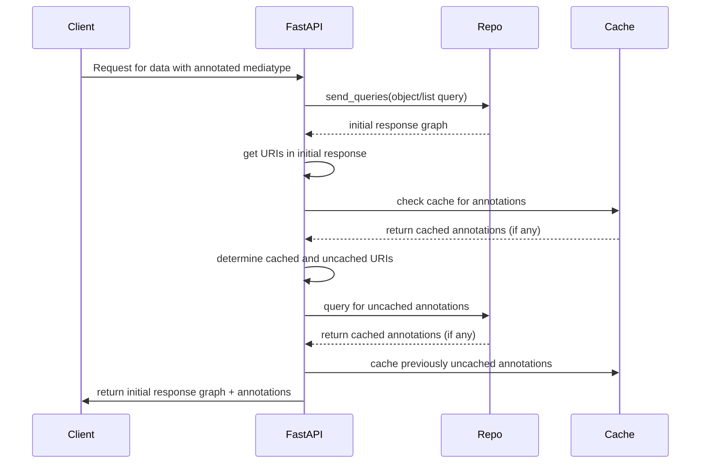

# Developer README

This documentation is to assist developers of Prez, not users or installers.

- [Developer README](#developer-readme)
  - [Contributing](#contributing)
  - [Profiles](#profiles)
    - [General profile specification](#general-profile-specification)
    - [Specification of Mediatypes and Resource Formats](#specification-of-mediatypes-and-resource-formats)
    - [Classes for a Profile](#classes-for-a-profile)
    - [Default profiles](#default-profiles)
    - [Direct Paths](#direct-paths)
    - [Sequence Paths](#sequence-paths)
    - [Inverse Paths](#inverse-paths)
    - [Combinations of paths](#combinations-of-paths)
    - [Excluded and Optional paths](#excluded-and-optional-paths)
    - [Blank Nodes](#blank-nodes)
    - [Profile and mediatype selection logic](#profile-and-mediatype-selection-logic)
  - [Focus Node Selection](#focus-node-selection)
    - [High level summary](#high-level-summary)
    - [Detail](#detail)
  - [Content delivered by Prez](#content-delivered-by-prez)
  - [Internal links](#internal-links)
    - [Link generation](#link-generation)
  - [Generating Prefixes](#generating-prefixes)
  - [Annotation properties](#annotation-properties)
  - [How to add an endpoint](#how-to-add-an-endpoint)
  - [Query Generation](#query-generation)
  - [Repositories](#repositories)
  - [Startup Routine](#startup-routine)
  - [High Level Sequence `/object` endpoint](#high-level-sequence-object-endpoint)
  - [High Level Sequence listing and individual object endpoints](#high-level-sequence-listing-and-individual-object-endpoints)
  - [Caching](#caching)

## Contributing

Prez is open source software, and contributions are welcome.

### Pre-Commit Hooks

To ensure that the below commit messaging and linting rules are enforced, you need to
install [pre-commit](https://pre-commit.com/#install) and then install the hooks for this repository

```bash
pre-commit install --hook-type pre-commit
pre-commit install --hook-type commit-msg
```

### Commit Messaging and Semantic Versioning

Use of [Conventional Commits](https://www.conventionalcommits.org/en/v1.0.0) is enforced via
[pre-commit](https://pre-commit.com/) hooks. This helps the maintainers
to keep the commit hisotry clean and to automate the release of new versions.

In short:

- `fix: and perf:` commits will automatically trigger a new patch version i.e. `0.0.1 --> 0.0.2`
- `feat:` commits will automatically trigger a new minor version i.e. `0.0.1 --> 0.1.0`, and
- commits with a `BREAKING CHANGE:` message will cause a new major version i.e. `0.0.1 --> 1.0.0`

These rules are as per the default settings for [python semantic release](https://python-semantic-release.readthedocs.io/en/latest/commit-parsing.html#semantic-release-commit-parser-angularcommitparser).

### Formatting and Linting

To keep the codebase consistent, pre-commit hooks are used to enforce formatting and
linting standards. The following tools are run before a commit:

| tool  | description                         |
| ----- | ----------------------------------- |
| ruff  | check for syntax and logical errors |
| black | apply consistent formatting         |
| isort | import sorting                      |

## Profiles

SHACL NodeShapes and PropertyShapes are utilised to determine which properties of Focus Nodes should be rendered.

### General profile specification

Each Profile must have the following properties:

- A `prof:Profile` type
- A type of either `prez:ObjectProfile` (for rendering objects) or `prez:ListingProfile` (for rendering lists of objects), or both.
- A title, identifier (with datatype xsd:token), and description, using the DCTERMS namespace.

### Specification of Mediatypes and Resource Formats

Extensions to SHACL are used to specify the mediatypes and resource formats available for a given profile. These are specified as follows. The namespace used is http://www.w3.org/ns/dx/connegp/altr-ext#, and the prefix used for this namespace is `altr-ext`.

#### Resource formats

The default resource format for a profile can be set with `altr-ext:hasDefaultResourceFormat`.
For example:

```turtle
prez:OGCSchemesObjectProfile
    a prof:Profile , prez:ObjectProfile , sh:NodeShape ;
    altr-ext:hasDefaultResourceFormat "text/turtle" ;
.
```

The available resource formats for a profile can be set with `altr-ext:hasResourceFormat`.
For example:

```turtle
prez:OGCSchemesObjectProfile
    a prof:Profile , prez:ObjectProfile , sh:NodeShape ;
    altr-ext:hasResourceFormat "text/turtle" , "application/ld+json" ;
```

#### Classes for a Profile

The classes of object which a profile constrains can be specified with `altr-ext:constrainsClass`.
Prez utilises this information when determining whether a requested profile can be used; and the alternate profiles that are available to render a resource. An example is given below:

```turtle
prez:OGCSchemesObjectProfile
    a prof:Profile , prez:ObjectProfile , sh:NodeShape ;
    altr-ext:constrainsClass dcat:Catalog ;
.
```

### Default profiles

A default profile can be specified using the `altr-ext:hasNodeShape` and `altr-ext:hasDefaultProfile` predicates. This is typically done on an "umbrella" profile which indicates default profiles for all classes the API can render. An example is given below:

```turtle
prez:OGCRecordsProfile
    a prof:Profile ;
    dcterms:identifier "ogc"^^xsd:token ;
    dcterms:description "A system profile for OGC Records conformant API" ;
    dcterms:title "OGC Profile" ;
    altr-ext:constrainsClass prez:CatPrez ;
    altr-ext:hasDefaultResourceFormat "text/anot+turtle" ;
    altr-ext:hasNodeShape [
        a sh:NodeShape ;
        sh:targetClass prof:Profile , dcat:Catalog , dcat:Resource , skos:Concept , geo:Feature , geo:FeatureCollection
                               , skos:Collection , rdf:Resource , prez:SearchResult , prez:CQLObjectList ;
        altr-ext:hasDefaultProfile prez:OGCListingProfile
    ] , [
        a sh:NodeShape ;
        sh:targetClass skos:ConceptScheme ;
        altr-ext:hasDefaultProfile prez:OGCSchemesListProfile
    ] , [
        a sh:NodeShape ;
        sh:targetClass skos:ConceptScheme ;
        altr-ext:hasDefaultProfile prez:OGCSchemesObjectProfile
    ] , [
        a sh:NodeShape ;
        sh:targetClass prof:Profile , dcat:Catalog , dcat:Resource , skos:Concept , geo:Feature , geo:FeatureCollection
                               , skos:Collection , rdf:Resource ;
        altr-ext:hasDefaultProfile prez:OGCItemProfile
    ]
    .
```

Note the target classes are shared across both listings of items, and items themselves; the API determines whether a listing or object profile is appropriate based on the endpoint a request is received at.

#### Direct Paths

Direct properties of a focus node are specified via `sh:path`.
Example:

```turtle
sh:property [
    sh:path prov:qualifiedDerivation
    ]
```

A convenience predicate is provided to specify the inclusion of all predicates, `shext:allPredicateValues`.
Example:

```turtle
sh:property [
    sh:path shext:allPredicateValues ;
	]
```

#### Sequence Paths

Sequence paths are specified as property shapes with a path representing the linked list of properties from a focus node.

```turtle
sh:property [
    sh:path ( prov:qualifiedDerivation prov:hadRole )
	]
```

#### Inverse Paths

Inverse paths are specified on a nested blank node where the first property is `sh:inversePath`.

```turtle
sh:property [
    sh:path [ sh:inversePath dcterms:hasPart ] ;
	]
```

#### Combinations of paths

Multiple paths can be specified at once using `sh:union`.

```turtle
sh:property [
    sh:path (
        sh:union (
          dcterms:publisher
          reg:status
          ( prov:qualifiedDerivation prov:hadRole )
          ( prov:qualifiedDerivation prov:entity )
        )
      )
    ]
```

### Excluded and Optional paths.

The above property paths when specified without a min or max count **must be present for a focus node to be returned.** That is, by default, specified paths must be present for the focus node and properties to be returned.
The following constructs can be used to specify excluded or optional properties.

#### Exclude

Specification: `sh:maxCount 0`
Interpretation: do not include these paths from the focus node, even if they exist in the data.
Example:

```turtle
sh:property [
    sh:maxCount 0 ;
    sh:path dcterms:hasPart
    ]
```

#### Optional

Specification: `sh:minCount 0`
Interpretation: include these paths from the focus node if they exist.
Example:

```turtle
sh:property [
    sh:minCount 0 ;
    sh:path dcterms:hasPart
    ]
```

### Blank Nodes

A convenience predicate is provided to specify the inclusion of blank nodes to a given depth, `shext:bnode-depth`. Note this is specified directly on the profile and not on a property shape as it does not relate to any particular property shape.
Specification: `shext:bnode-depth`
Example:

```turtle
prez:OGCSchemesObjectProfile
    a prof:Profile , prez:ObjectProfile , sh:NodeShape ;
	shext:bnode-depth 2 ;
```

### Profile and mediatype selection logic

The following logic is used to determine the profile and mediatype to be returned:

1. If a profile and mediatype are requested, they are returned if a matching profile which has the requested mediatype is found, otherwise the default profile for the most specific class is returned, with its default mediatype.
2. If a profile only is requested, if it can be found it is returned, otherwise the default profile for the most specific class is returned. In both cases the default mediatype is returned.
3. If a mediatype only is requested, the default profile for the most specific class is returned, and if the requested mediatype is available for that profile, it is returned, otherwise the default mediatype for that profile is returned.
4. If neither a profile nor mediatype is requested, the default profile for the most specific class is returned, with the default mediatype for that profile.

The SPARQL query used to select the profile is given in [Appendix D](appendix-d---example-profile-and-mediatype-selection-sparql-query).

## Focus Node Selection

### High level summary

For object endpoints, the (single) focus node is specified at runtime, either as a URL path parameter or query string argument.

For listing endpoints, the following inputs are used to determine which nodes to select:

1. Endpoint - an endpoint is mapped to one or more endpoint SHACL NodeShapes.
2. CQL JSON - only used as filter, i.e. filters on specified predicates.
3. Search term - filters the label properties of focus nodes to a given search term. Currently a REGEX search is supported.

All listing endpoints support these inputs. The inputs are transformed into the SPARQL Grammar, merged together, and combined with SPARQL Grammar for profiles to create a single query. Profiles specify the inclusion/exclusion of properties on focus nodes, and are detailed in "Profile Design".

### Detail

Determine **which** nodes to select.
This forms the inner select part of the SPARQL query. The inputs are one or more of: the URL path a query is sent to; a CQL filter expression; and a search term. The outputs are three sets of SPARQL Grammar objects `TriplesSameSubject`, `TriplesSameSubjectPath`, and `GraphPatternNotTriples`. The `TriplesSameSubject` are used to form the `ConstructTriples` part of the query; the `TriplesSameSubjectPath`, and `GraphPatternNotTriples` form the `WhereClause`.

#### 1. Endpoint Nodeshapes:

Considerations:

1. Class of objects to list (e.g. for /catalogs, list all items of class dcat:Catalog)
2. Relationship to parent objects (e.g. for /catalogs/{parent_catalog_curie}/collections/, list all items that have the relationship dcterms:hasPart from the parent catalog curie)
   Implementation:
   SHACL shapes are used to represent the how URL path parameters are translated into a SPARQL query.
   One endpoint maps to one or more endpoint NodeShapes. For example the items endpoint can render resources of type `skos:Concept` and `geo:Feature`. An example of an endpoint definition is:

```turtle
ogce:item-object
    a ont:ObjectEndpoint ;
    ont:relevantShapes ex:Feature , ex:ConceptSchemeConcept , ex:CollectionConcept , ex:Resource ;
.
```

To determine which NodeShape (under `ont:relevantShapes`) should be used to render resources, the class of parents in the URL path is first determined. The logic for this is: 1. Get the classes of all parents in the URL path. Prez caches this class information. 2. Match these to `sh:class` statements on the PropertyShapes for the NodeShape. _`sh:class` is used on nested PropertyShapes to specify a constraint on the class of related nodes, that is, nodes related via the property shape. (e.g. "the class of the first parent is `dcat:Resource`, the class of the second parent is `dcat:Catalog`, therefore the applicable NodeShape for the listing is the `ex:Resource` NodeShape.)_
The NodeShape information, once determined, is used for: 1. Query generation - which class of nodes to list (e.g. `rdf:Resource` below) 2. Link generation - to determine which endpoints can render a resource of a given class, and, how to find the parents of a given object in order to generate a link (e.g. the parents are all related via `dcterms:hasPart` in the example below.)
An example NodeShapes for describing an endpoint is:

```turtle
ex:Resource
    a sh:NodeShape ;
    ont:hierarchyLevel 3 ;
    sh:targetClass rdf:Resource ;
    sh:property [
        sh:path [ sh:inversePath dcterms:hasPart ] ;
        sh:class dcat:Resource ;
    ] , [
        sh:path ( [ sh:inversePath dcterms:hasPart ] [ sh:inversePath dcterms:hasPart ] );
        sh:class dcat:Catalog ;
    ] .
```

_The hierarchyLevel is used to filter the set of potentially relevant NodeShapes - when a request comes from an endpoint, that endpoint has a corresponding hierarchy level._

A further example for the collections endpoint is provided:

```turtle
ex:Collections
	a sh:NodeShape ;
	ont:hierarchyLevel 2 ;
	sh:targetClass geo:FeatureCollection , skos:ConceptScheme , skos:Collection , dcat:Resource ;
	sh:property [
		sh:path [ sh:inversePath dcterms:hasPart ] ;
		sh:class dcat:Catalog ;
	] .
```

This means to select the nodes of class `dcat:Resource`, `geo:FeatureCollection`, `skos:ConceptScheme`, or `skos:Collection`, which are related to a parent node of class `dcat:Catalog`, by the relationship `dcterms:hasPart`.

#### 2. CQL

Considerations:

1. Mapping of JSON values to URIs.
2. Filtering of properties vs. graph pattern matching; the latter supports more complex operations (sequence, inverse paths etc.).
   Implementation:
   CQL JSON expressions are translated to JSON LD to allow easy mapping to URIs.
   Examples are provided in the API docs using test data. A demo instance is available [here](https://prezv4-with-fuseki.sgraljii8d3km.ap-southeast-2.cs.amazonlightsail.com/docs#/ogcprez/https___prez_dev_endpoint_extended_ogc_records_cql_post_cql_post).
   CQL JSON documentation is available [here](https://portal.ogc.org/files/96288#cql-json):

Properties are assumed to be URIs.
Values for properties can be specified as URIs using a JSON LD like "@id", for example:

```json-ld
{
  "op": "=",
  "args": [
    {
      "property": "http://www.w3.org/2000/01/rdf-schema#member"
    },
    { "@id": "http://example.com/datasets/sandgate/facilities" }
  ]
}
```

The following context is "inserted" into CQL JSON to create "CQL JSON-LD".

```json-ld
{
  "@version": 1.1,
  "@base": "http://example.com/",
  "@vocab": "http://example.com/vocab/",
  "cql": "http://www.opengis.net/doc/IS/cql2/1.0/",
  "sf": "http://www.opengis.net/ont/sf#",
  "geo": "http://www.opengis.net/ont/geosparql#",
  "landsat": "http://example.com/landsat/",
  "ro": "http://example.com/ro/",
  "args": {
    "@container": "@set",
    "@id": "cql:args"
  },
  "property": {
    "@type": "@id",
    "@id": "cql:property"
  },
  "op": {
    "@id": "cql:operator"
  },
  "type": {
    "@id": "sf:type"
  }
}
```

The following has been implemented:

1. Spatial functions
2. String pattern matching
3. Property filtering

The following has not yet been implemented:

1. Time filtering

#### 3. Search query.

Implementation:
The search term is inserted into three different regex expressions which match the search term in different ways, and weights the results. A full search query is generated, and then relevant parts are extracted (`TriplesSameSubject` etc. as listed above), to generate a final query.

Prez utilises the sparql-grammar-pydantic library to generate SPARQL queries.

## Content delivered by Prez

Prez returns:

- RDF data for specified objects
- RDF data for lists of objects
- Annotated RDF\* for specified objects
- Annotated RDF\* for lists of objects
- Available Profiles
- An alternates profile for every object or listing, listing all available profiles and mediatypes
- OpenAPI documentation for the API

\* Annotated RDF is RDF which includes labels, descriptions, explanatory, and other properties for all RDF terms. The predicates Prez looks for are rdfs:label, `dcterms:description`, and `dcterms:provenance`. The list of predicates Prez looks for can be extended in the profiles.

## Internal links

The objects Prez delivers RDF for have URIs that uniquely identify them. Prez delivers RDF for these objects at URLs on the web. These URLs and URIs are not required to be the same, and frequently are not. For objects that Prez holds information for, it is helpful if Prez tells users the URL of these when they are referenced elsewhere in the API. This is in two places:

1. Listings of objects, for example `dcat:Catalog` at the `/catalogs` endpoint; and
2. Links to related objects, where the API holds information on the related object.\
   In these cases, in the annotated RDF mediatype (`text/anot+turtle`) URL paths are provided which link to the related object.

For cases where URIs and URLs for a given object differ, URL redirection can be used to send users to the Prez URL instance which displays information for the object.

### Link generation

Internal links use [CURIEs](https://en.wikipedia.org/wiki/CURIE). Prez uses the default RDFLib prefixes, covering common namespaces.
Additional prefixes can be specified using the Vann ontology property "vann:preferredNamespacePrefix". These can be added to turtle files in the prez/reference_data/prefixes directory.
Any turtle files in this directory will be loaded on startup.

When Prez encounters a URI which is required for an internal link but is not in the current known prefixes, it will generate a prefix using the following logic:

1. Get the "second to last part" of the URI; either the part before a fragment if it exists, or the second to last path segment otherwise.
2. If this second to last part is less than six characters, use it as is, else:
3. Remove vowels from the second to last part and use this as the prefix.
4. If this prefix fails to bind for any reason, use RDFLib's default "ns1", "ns2" etc. prefixes.

To get "sensible" or "nice" prefixes, it is recommended to add all prefixes which will be required to turtle files in prez/reference_data/prefixes.
A future change could allow the prefixes to be specified alongside data in the backend, as profiles currently can be.

## Generating Prefixes

The following SPARQL query can be used as a starting point to check if a namespace prefix is defined for instances of
the main classes prez delivers. NB this query should NOT be run against SPARQL endpoints for large datasets; offline
options should instead be used.
NB. for "short" URIs, i.e. a hostname with no fragments and a "no" path, this query will (correctly, but uselessly)
return "http://" or "https://". You will need to otherwise identify what these URIs are and provide prefixes for them
should you wish.

```sparql
PREFIX skos: <http://www.w3.org/2004/02/skos/core#>
PREFIX vann: <http://purl.org/vocab/vann/>
PREFIX dcat: <http://www.w3.org/ns/dcat#>
PREFIX geo: <http://www.opengis.net/ont/geosparql#>

SELECT DISTINCT ?namespace
{?uri a ?type
  BIND (REPLACE(STR(?uri), "(.*[/#])[^#/]*$", "$1") AS ?namespace)
  VALUES ?type { skos:Collection skos:ConceptScheme skos:Concept dcat:Dataset geo:FeatureCollection geo:Feature dcat:Resource dcat:Catalog }
  MINUS {?namespace vann:preferredPrefix ?prefix .}
} LIMIT 100
```

## Annotation properties

Prez recognises the following kinds of annotation properties, and can return RDF, either via SPARQL queries, or the
endpoints as annotated RDF.

When an annotated mediatype is requested (e.g. `text/anot+turtle`), Prez will look for the following predicates for
_every_ RDF term in the (initial) response returned by the triplestore. That is it will expand the response to include
the annotations and return the RDF merge of the original response and the annotations.

Additional predicates can be added to the list of predicates Prez looks for in the profiles by adding these predicates to the configuration.

## How to add an endpoint

New endpoints can be added to Prez by adding RDF, and minimal addition of FastAPI decorators.

1. Add FastAPI decorator,
   1. For Listing endpoints, add these to the `listings` function in `prez/routers/ogc_router`. An example is:

```python
@router.get(
    "/catalogs",
    summary="Catalog Listing",
    name=OGCE["catalog-listing"],
    responses=responses
)
```

_See the references in the code for what should be provided for `responses` and `openapi_extra`; these fields are optional but useful for documentation._
The name is required, and should be a URI. 2. An endpoint definition. 1. **The endpoint URI must match the name uri in the decorator.** 2. The endpoint must be declared a `ont:ListingEndpoint` or `ont:ObjectEndpopint`, as Prez uses different application code to render results for these two types of endpoint.
These are in `prez/reference_data/endpoints/endpoint_metadata.ttl`. An example is:

```turtle
ogce:catalog-listing
    a ont:ListingEndpoint ;
    ont:relevantShapes ex:Catalogs ;
.
```

3.  A NodeShape for the endpoint. This describes how nodes should be selected at the given endpoint. An example is:

```turtle
ex:Catalogs
    a sh:NodeShape ;
    ont:hierarchyLevel 1 ;
    sh:targetClass dcat:Catalog ;
    sh:property [
        sh:path dcterms:hasPart ;
        sh:or (
            [ sh:class dcat:Resource ]
            [ sh:class geo:FeatureCollection ]
            [ sh:class skos:ConceptScheme ]
            [ sh:class skos:Collection ]
        ) ;
    ] .
```

This specifies the selection of focus nodes of class `dcat:Catalog` which have the relationship `dcterms:hasPart` to one or more of the listed classes.

## Query Generation

Prez utilises the sparql-grammar-pydantic library to generate SPARQL queries.

### Focus nodes

For objects, the focus node is specified in a query path as a curie, or in the case of the `/object` endpoint, as query parameter with the key "uri".
For lists of objects, the focus node is a variable, fixed within prez to `?focus_node`.
**Usage:** The focus node is substituted into the main query.

### Main Query Generation

Prez creates a single main query to describe an object or listing of objects.

The structure of the query is as follows:

```sparql
CONSTRUCT {
    <construct_triples + construct_tss_list>
}
WHERE {
    # for listing queries only:
    {
	    SELECT ?focus_node <innser_select_vars>
	    WHERE {
		    <inner_select_tssp_list>
		    <inner_select_gpnt>
		    }
		ORDER BY <order_by_direction>(<order_by>)
	    LIMIT <limit>
	    OFFSET <offset>
    }
    # for all queries:
    <profile_triples>
    <profile_gpnt>
}
```

#### construct_triples and construct_tss_list

The triples to construct. This is taken from the union of:

1. Profile_Triples (directly) - i.e. any triple specified in the where clause will be constructed
2. Any triples within the Profile_GPNTs object. _Prez utilises a convenience function provided by the SPARQL Grammar library which recursively extracts all triples within a given SPARQL Grammar object._
3. Additional_Construct_Triples (directly) - these may come from a search query, such as the query result weights, etc.

#### profile_triples and profile_GPNTs

There is one source of profile triples and profile GPNTs - these are derived from SHACL node and property shapes associated with the selected profile (returned by ConnegP).

At a conceptual level these profile shapes represent the "properties" or "attributes" to be returned for _each_ focus node. At present the following SHACL expressions are covered:

- minCount = 0 (optional property)
- maxCount = 0 (exclude property)
- path
- sequence path
- inverse path
- class
- blank nodes to a specified depth
  How to specify these is detailed in the Profile Design section.

#### Inner_Select_Triples and Inner_Select_GPNTs

Inner Select Triples and Inner Select GPNTs are taken from the union of:

1. CQL
2. Search queries
3. Endpoint Nodeshapes
   These are detailed in the Focus Node Selection section.

### Annotations

- Where an annotated mediatype is requested, Prez returns any annotations it can find from all available repositories (data, systems, and annotations reposoitory).
- These annotations are then cached against the URI they are for.
- The caching utilises aiocache.
  - aiocache is currently set up with in memory caches. It could be extended to utilise Redis.

A sequence diagram is shown for annotation retrieval:



Annotations are returned with one of the following mapped prez namespaced URIs.

prez:label: skos:prefLabel, dcterms:title, rdfs:label, sdo:name
prez:description: skos:definition, dcterms:description, sdo:description
prez:provenance: dcterms:provenance

### Repositories

An abstraction over data providers is provided with "Repositories". Three types are supported; Pyoxigraph (in memory), Oxrdflib, and RemoteSparql.

1. Data repository - one of Pyoxigraph, Oxrdflib, or RemoteSparql
2. System repository - Pyoxigraph
3. Annotations repository - Pyoxygraph

## Startup Routine

1. Check the SPARQL endpoints can be reached. A blank query (`ASK {}`) is used to test this. The SPARQL endpoints are not health checked post startup.
2. Create in memory profile, prefix, and endpoint graphs, containing all profiles in the `prez/profiles` directory, and any additional profiles available in the triplestore (declared as a `http://www.w3.org/ns/dx/prof/Profile`)
3. Look for predefined object counts in the triplestore.

## High Level Sequence `/object` endpoint

### Prez UI or similar human-actionable client

Prez provides a `/object` endpoint as an endpoint that supplies any information known about a given URI. If an annotated
mediatype is requested, prez will additionally provide all system links for endpoints which can render the object. The
high level sequence for this endpoint is as follows:

1. Get the URI for the object from the query string
2. Get the class(es) of the object from the triplestore
3. Use prez's reference data for endpoints to determine which endpoints can render this object, and, a template for
   these endpoints, specifying any variables that need to be substituted (such as parent URIs).
4. Get the object information from the triplestore, using an open profile, and in parallel any system information needed
   to construct the system links.
5. Return the response

## Specification of remote SPARQL templates for Object endpoints

The OGC Features endpoints can utilise custom SPARQL templates.
At present the queries must be of the form:

```sparql
PREFIX geo: <http://www.opengis.net/ont/geosparql#>
PREFIX rdf: <http://www.w3.org/1999/02/22-rdf-syntax-ns#>
PREFIX sosa: <http://www.w3.org/ns/sosa/>
CONSTRUCT {
 ...
}
WHERE {
    VALUES ?focusNode { UNDEF }
...
}
```

At present the queries are ONLY substituted with the focus node URI, and only for OGC Features endpoints. It is intended that this functionality will provide the basis for a more general templating system across all OBJECT endpoints in the future.
These templates should be declared in the remote repo in this format:

```sparql
PREFIX prez: <https://prez.dev/ont/>
PREFIX rdf: <http://www.w3.org/1999/02/22-rdf-syntax-ns#>
INSERT DATA { GRAPH <https://prez/system> {
    [ a prez:TemplateQuery ;
        rdf:value """<template_queries>
""" ;
        prez:forEndpoint "http://www.opengis.net/ogcapi-features-1/1.0/feature" ;
    ]
    }}
```

Prez will detect these template queries and when a request comes in on the endpoint with the relevant URI, utilise the template query.

Templates can also be specified in `prez/reference_data/xxx.rq`, and mapped to an endpoint using the `endpoint_to_template_query_filename` setting (can be set as an environment variable), where `xxx.rq` is the filename of the template query. For example:

```bash
export ENDPOINT_TO_TEMPLATE_QUERY_FILENAME='{"http://www.opengis.net/ogcapi-features-1/1.0/feature": "xxx.rq"}'
```

## High Level Sequence listing and individual object endpoints

Prez follows the following logic to determine what information to return, based on a profile, and in what mediatype to return it.

1. Determine the URI for an object or listing of objects:  

- For objects:  
  - Directly supplied through the /object?uri=<abc> query string argument  
  - From the URL path the object is requested from, for example /catalogs/<abc>. abc is a curie, which is expanded to a URI.  

2. Get all classes for the object or object listing  
3. Determine the profile and mediatype to use for the object. This is implemented as a SPARQL query and takes into account:  
   1. The classes of the object  
   2. Available profiles and mediatypes  
   3. Requested profiles and mediatypes  
   4. Default profiles and mediatypes  
      The logic used to determine the profile and mediatype is detailed in section x.  
4. Build a SPARQL query.  
5. Execute the SPARQL query.  
6. If the mediatype requested is NOT annotated RDF (`text/anot+turtle`), return the results of 5, else retrieve the annotations:  
   1. Check Prez cache for annotations  
   2. For terms without annotations in the cache, query the triplestore for annotations  
   3. Cache any annotations returned from the triplestore  
   4. Return the annotations merged with the results of the SPARQL query in step 5.  


## Caching

Prez caches the following things using aiocache:
1. Classes  
2. Annotations - those predicates listed under `label_predicates`, `description_predicates`, and `provenance_predicates` in the settings.  
3. Internal links generated for items  
3. Feature Collection information *at the feature listing endpoint only*. These are cached for 10 minutes only.   
There is no other caching of "instance" data in Prez.


